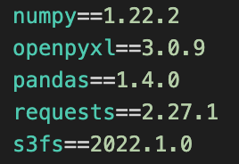
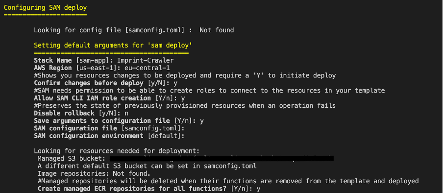

# Guide for setting up AWS Lambda functions with AWS SAM framework
## In this guide I want to explain how you can set up your first AWS Lambda functions in Python with AWS SAM (Serverless Application Model).

**Why use AWS SAM?:**

  - development in IDE

  - local testing

  - packaging of dependencies with docker images

  - easy deployment/configuration of Lambda functions

### Requirements:

  - Python

  - AWS

  - SAM

  - Docker

[Guide for installing on Mac](https://docs.aws.amazon.com/serverless-application-model/latest/developerguide/serverless-sam-cli-install-mac.html)

#### 1\. Set up Lambda Function in SAM with package type Image

**sam init**

Process for initializing SAM App

  - Chose desired runtime version

  - Quick start templates/app-template doesn’t have to be hello-world,
    but it is a good foundation

  - base-image should be chosen according to preferred runtime

  - name is up to you

#### **2. Adapt template.yaml**

Set timeout to 120 or more

Also comment out or delete everything involving the API from the hello world
app-template, as we don’t need that resource and it just produces cost

If wanted you can also change the Role/Policy to for example
S3ReadAccess, but that can also be adjusted in AWS after deployment.

#### **3. Import libraries**

Now let’s move on to adding the required dependencies

Add the packages and specify version in the requirements.txt

Import them then to the app.py or other python files, where you need
them

#### **4. Code**

To add helper functions or other python files, they also need to be
added to the dockerfile, so that they are copied into the image.

**  Dockerfile:**

Every file to be copied into the image
[Dockerfile](images/dockerfile.png)

**Folder Structure:**

#### **5. Build Image**

*sam build*

builds Docker Image

 

#### **6. Test Locally**

*sam local invoke*

Runs Image and tests locally

#### **7. Deploy to AWS**

*sam deploy –guided*

Guided is optional, but recommended

Just follow the steps and select the right region for deployment
(eu-central-1)

**Other great guides:**

<https://medium.com/platform-engineer/automating-lambda-container-image-deployments-with-aws-sam-cli-71afbf09e172>

https://docs.aws.amazon.com/serverless-application-model/latest/developerguide/serverless-getting-started-hello-world.html

#### Potential errors:

"errorMessage": "Unable to import module 'app': No module named 'app'",
"errorType": "Runtime.ImportModuleError", "stackTrace"

  - often folder structure or import problems (check dockerfile, if
    every file is being copied and imports/requirements.txt)

  - potential other errors are python dependencies, that are different in
    macOS/local environment and Linux environment (AWS Lambda)

  - also always check region, especially when deploying

#### Next Steps:

**S3 Event Trigger:**

[AWS Docs](https://docs.aws.amazon.com/lambda/latest/dg/with-s3-example.html)

**Step Functions for Orchestration of Lambda Functions:**

[My Guide](https://github.com/SamiHaddouti/Orchestrate-Lambda-Functions-with-Step-Functions)

[Youtube Guide](https://www.youtube.com/watch?v=KcoLDAhLpbg)
